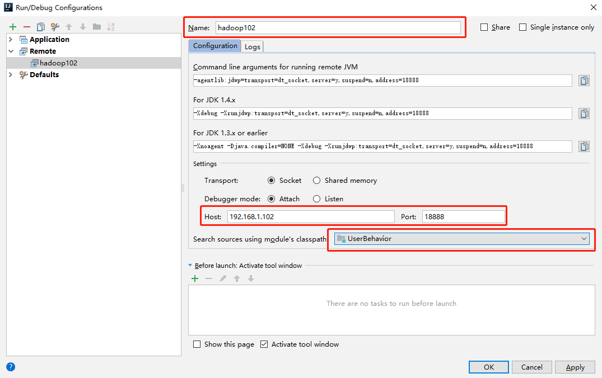
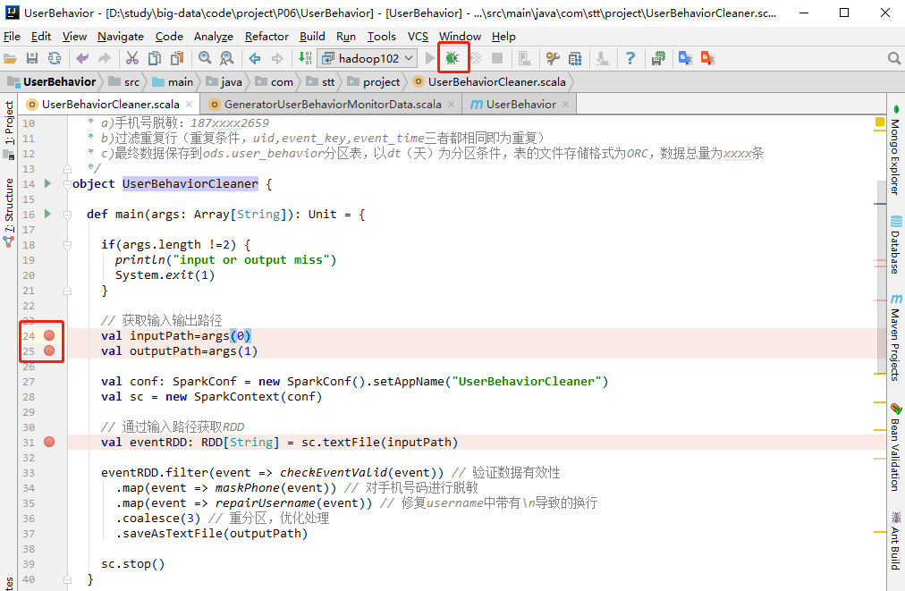

# 动态指定参数

- vm options
  - -Dspark.master=local[*]
  - -Dspark.testing.memory=1073741824


# 远程调试

场景：以后工作中经常会遇到在本地执行没有问题，到了服务器跑的数据就是错误的

- IDEA设置：Run --> Edit Configurations添加Remote

 

- 在提交脚本中添加--driver-java-options参数

```bash
spark-submit --master local[2] \
--driver-java-options "-agentlib:jdwp=transport=dt_socket,server=y,suspend=y,address=18888" \
--class com.atguigu.user_behavior.UserBehaviorCleaner UserBehaviorCleaner.jar \
hdfs://hadoop102:9000/user/hive/warehouse/ods.db/origin_user_behavior/${day} \
hdfs://hadoop102:9000/user/hive/warehouse/tmp.db/user_behavior_${day}
```

- 使用
  - 在tomcat等项目中suspend要设置为n
  - 在spark项目需要设置suspend为y，挂起阻塞

```bash
bin/spark-submit --master local[2] \
--driver-java-options "-agentlib:jdwp=transport=dt_socket,server=y,suspend=y,address=18888" \
--class com.stt.project.UserBehaviorCleaner /opt/soft/ub.jar \
hdfs://hadoop102:9000/user/hive/warehouse/ods.db/origin_user_behavior/20190402 \
hdfs://hadoop102:9000/user/hive/warehouse/tmp.db/user_behavior_20190402


[ttshe@hadoop102 spark]$ bin/spark-submit --master local[2] \
> --driver-java-options "-agentlib:jdwp=transport=dt_socket,server=y,suspend=y,address=18888" \
> --class com.stt.project.UserBehaviorCleaner /opt/soft/ub.jar \
> hdfs://hadoop102:9000/user/hive/warehouse/ods.db/origin_user_behavior/20190402 \
> hdfs://hadoop102:9000/user/hive/warehouse/tmp.db/user_behavior_20190402
Listening for transport dt_socket at address: 18888
# 在服务器提交任务，此时任务处理阻塞状态
```

- 在idea中点击Remote服务对应的debug按钮，在代码上打上断点即可调试




# shell调试

- 在生产环境中一般是不允许使用远程调试的，可以使用spark-shell进行调试处理

```bash
[ttshe@hadoop102 spark]$ bin/spark-shell --jars /opt/soft/u5.jar  # 可指定yarn模式，注意是client端运行
scala> # 写入业务代码的核心逻辑，不用初始化sparkContext
```

