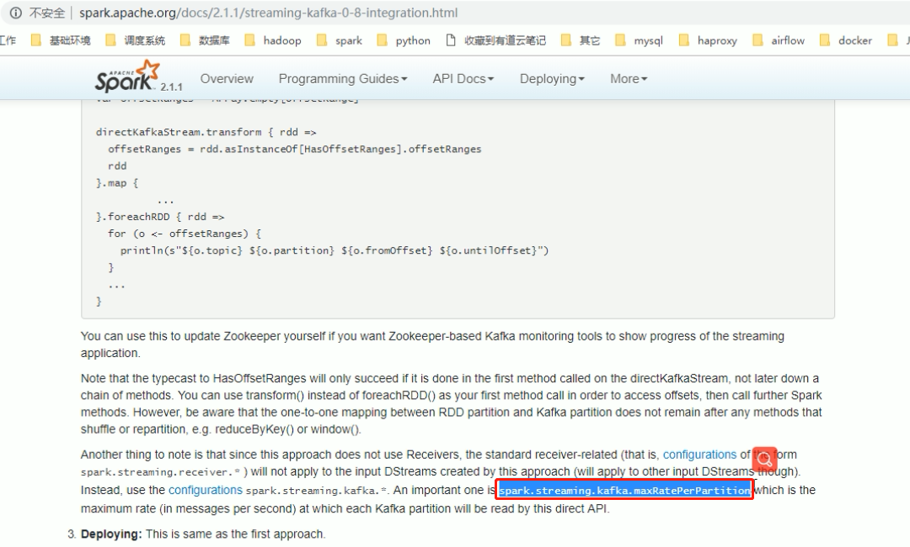
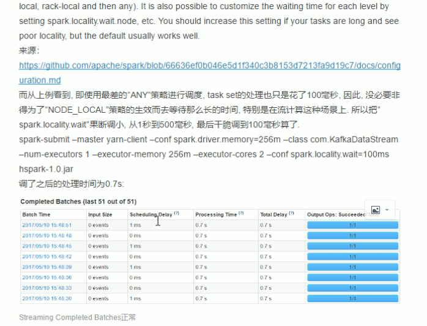
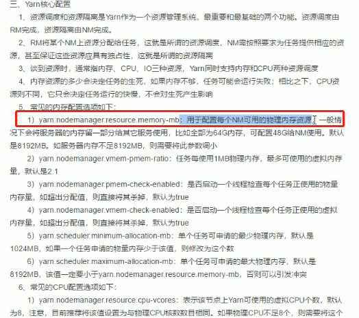
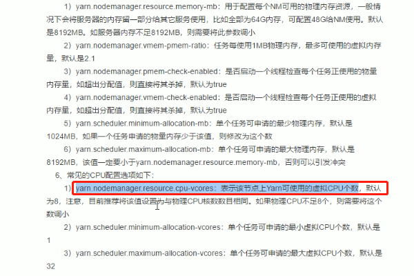

# yarn cluster和yarn client区别

- Driver运行的位置不同
- yarn-client端运行的瓶颈是网络IO，客户端网卡流量打满，网络IO负载过高
- yarn-cluster的driver运行在nodemanager上

# Textfile、Parquet、ORC格式选择

- 亮点：使用ORC后，空间节省90%，查询提升3-5倍

- 如何测试
  - 使用相同的2份数据，一份textFile，一份orc
  - 跑10个最常用的sql，取得平均数评判

# 外部表与内部表在企业中怎么使用

- 数仓中的表都使用外部表
- 分析而生成的中间结果表，都使用内部表，并且这类表一般以日期结尾，这样可以清晰意识到这是个中间表，还能知道是哪天创建的。这类表当天使用完后就会在脚本的最后将其删除

# union 和 union all 的区别

- union 会对结果去重
- union all 不会对结果去重
  - 使用union all ，从业务角度而言，2张表不会有重复数据，可使用union all 提升性能

# hive 的 job的个数判定

- sql中select的个数或者看from的个数
  - hive会做优化，最多是select的个数

# sparkStreaming：流量抖动处理

- 流量抖动，短时间内大量事件产生，如何处理流量峰值

- 方式1

  - 查看官网配置参数进行测试

  

  - 进行压测，看到延时是0ms，说明性能可以继续提升

  

- 上面的方式可能不准，当有人在集群上提交任务，影响测试

- 方式2

  - 使用背压，由于使用了拉取kafka消费的方式direct，依据算法知道客户端的消费能力，开启`spark.streaming.backpressure.enabled=true`，在spark1.5引用的

# kafka：为什么没有把offset保存到zk中

- 在sparkStreaming中可以构成事务控制
- kafka在0.9之前是保存在zk中，0.9之后保存在kafka服务端（默认50个分区），为什么
  - kafka官方团队发现，topic数量过多，将offset保存在zk中，zk有性能瓶颈
  - zk是做分布式服务协调，而非分布式存储

# executor配置：离线项目真实场景分析

- executor memory和executor cores如何设置?

  - 默认值在spark-env.sh脚本中有写明

  - memory默认1G

  - driver memory 默认1G

  - cores默认1个

  - 在20台机器：2160G（`108*20`），720线程cpu（`36*20`）

     

     

    - 每台128G内存，40核cpu，8T硬盘
    - 36线程给计算任务，4线程给其他任务
    - 108G可以分配任务

- 集群情况说明
  - 20台 128G内存，40线程CPU，4T硬盘 * 4
  - 每台服务器分给Yarn管理的资源为 36线程，108G内存（因为CPU数量尽量与内存量是一个整数比，此处为1：3）
  - 所以Yarn能够管理的总资源为2160G内存和720线程CPU

- 数据情况：用户行为数据每日新增200G，约2亿条数据

- 使用SparkCore清洗时，使用On Yarn模式，如何设置job资源
  - 首先确认--executor-cores，官方建议2-5个，超过5个时不会有性能的明显提升，但是却占用了更多的cpu资源，此处我们设置为4
  - 再确认--executor-memory，因为上面说了比例为1：3，所以此处设置为12G（4核*3G）
  - 最后确认--num-executors，而此项又需要根据提交任务所在队列的最大资源和多少应用程序并行执行，比如Yarn中只有4个队列，各占25%，每个队列需要并发执行4个任务，所以任务可以获取45线程CPU和135G内存，上面2点已经确认了每个executor需要的cpu和内存，直接相除，向下取整即可，所以executor数量在此场景下设置为10最合适
  - executor
    - cpu：4
    - memory：12G
    - num
      - 资源池2160G，cpu720
      - yarn中4个队列，每个队列4个任务并行执行，共16个任务同时执行
        - 每个任务分配的cpu 核数 720/16=45，内存45*3=135G
        - 每个任务可以执行的executor个数为 45/4 约 11 向下取整 10

- 使用上面的资源提升任务时，比如需求是清洗200G数据，大概耗时5-10分钟

# kafka：副本数为3，最大能容错几个副本？是否一定能够容错这些

- 最大容错2个逼本，当有副本不在ISR中时，就不能容错2个了

- 什么情况下副本不在ISR中？ 0.9版本之后，follwer落后leader [replica.log.time.max.ms](http://replica.log.time.max.ms/) 的时间后，即不在ISR中，默认为10S
- 

# kafka：如何保证某些消息在Kafka中可以全局有序的消费

- 为这部分消息设置key，所以相同的key会进入同一个分区

- 如果问题变成保证某个Topic的消息要全局有序消费，那只能设置一个分区了

如果从检查点创建sparkSessionContext，如果修改rdd代码，会启动失败

如何解决

方式1：

- 重写业务逻辑。创建新的检查点，将kafka的消费的信息从最早 的开始读取 auto.offset.reset = smallest
- 当2套程序执行的结果效果一致后，关闭旧的版本程序

方式2：

- 半夜上线处理，因为是当日显示数据

# HDFS 垃圾箱

- 在hadoop的core-site.xml中进行配置
  - fs.trash.interval，单位分钟
  - 至少3天，安全期限是7天
- 删除后在.Trash文件夹下，使用hadoop fs -mv 进行移动即可恢复

- 使用rdd.foreachPartition的方式保存offset是否可行

不行，因为后续算子有分区操作，rdd的分区会变化

updateStateByKey的算子问题，使用mapWithState代替，可是mapWithState是实验算子，也有问题

updateStateByKey会一直返回之前的历史状态信息

# 如何优雅的关闭streamingContext

- 在conf中添加关闭配置
- 然后使用如下命令优雅的关闭

# 项目

## Kafka的Direct和Reciver方式相比有何优势

这种新的不基于Receiver的直接方式，是在Spark 1.3中引入的，从而能够确保更加健壮的机制。替代掉使用Receiver来接收数据后，这种方式会周期性地查询Kafka，来获得每个topic+partition的最新的offset，从而定义每个batch的offset的范围。当处理数据的job启动时，就会使用Kafka的简单consumer api来获取Kafka指定offset范围的数据

具体来说，主要有以下3点：

1) 简化并行读取：

如果要读取多个partition，不需要创建多个输入DStream然后对它们进行union操作。Spark会创建跟Kafka partition一样多的RDD partition，并且会并行从Kafka中读取数据。所以在Kafka partition和RDD partition之间，有一个一对一的映射关系

2) 高性能：

如果要保证零数据丢失，在基于receiver的方式中，需要开启WAL机制。这种方式其实效率低下，因为数据实际上被复制了两份，Kafka自己本身就有高可靠的机制，会对数据复制一份，而这里又会复制一份到WAL中。而基于direct的方式，不依赖Receiver，不需要开启WAL机制，只要Kafka中作了数据的复制，那么就可以通过Kafka的副本进行恢复。

3) 可靠的事务机制：

基于receiver的方式，是使用Kafka的高阶API来在ZooKeeper中保存消费过的offset的。这是消费Kafka数据的传统方式。这种方式配合着WAL机制可以保证数据零丢失的高可靠性，但是却无法保证数据被处理一次且仅一次，可能会处理两次。因为Spark和ZooKeeper之间可能是不同步的。 基于direct的方式，使用kafka的简单api，Spark Streaming自己就负责追踪消费的offset，可以保证output操作和保存offset操作是同步的(两个操作放入到一个事务中)，因此可以保证数据是消费一次且仅消费一次。

## 设置Checkpoint的最佳时间间隔是多少

批处理时间的5 - 10倍

## checkpoint中保存了哪些数据？

\1. 元数据checkpoint：

1) 配置信息——创建Spark Streaming应用程序的配置信息，比如SparkConf中的信息。

2) DStream的操作信息——定义了Spark Stream应用程序的计算逻辑

3) 未处理的batch信息——那些job正在排队，还没处理的batch信息。 

\2. 数据checkpoint

将实时计算过程中产生的RDD的数据保存到可靠的存储系统中。比如状态RDD

一句话概括，元数据checkpoint主要是为了从driver失败中进行恢复；而RDD checkpoint主要是为了，使用到有状态的transformation操作时，能够在其生产出的数据丢失时，进行快速的失败恢复。

 

## 是否一定要设置Checkpoint

如果没有使用带状态的算子，程序没有强制要求设置checkpoint时就不要设置checkpoint，因为会影响流式计算的吞吐量

 

## 遇到流量激增时如何处理？比如之前每个batch1W条，活动时突然变成每个batch100W条。我们要怎么做

基于Direct方式下设置spark.streaming.backpressure.enabled=true即可

## 我们为什么没有将offset保存到ZK中

 

## 如何实现精确一次消费的语义

使用Direct方式，手动控制offset，将保存offset操作和output操作写入到一个事务。

 

## 如何优雅停止SparkStreaming程序

设置spark.streaming.stopGracefullyOnShutdown为true，关闭程序的时侯使用kill -SIGTERM <AM-PID>方式

 

## Kafka副本数为3，最大能容错几个副本？是否一定能够容错这些？

最大容错2个逼本，当有副本不在ISR中时，就不能容错2个了

## 什么情况下副本不在ISR中？

0.9版本之后，follwer落后leader `replica.log.time.max.ms`的时间后，即不在ISR中，默认为10S

 

## 如何保证某些消息在Kafka中可以全局有序的消费

为这部分消息设置key，所以相同的key会进入同一个分区

通过生产者，指定这部分消息发送到同一个partition

如果问题变成保证某个Topic的消息要全局有序消费，那只能设置一个分区了

 